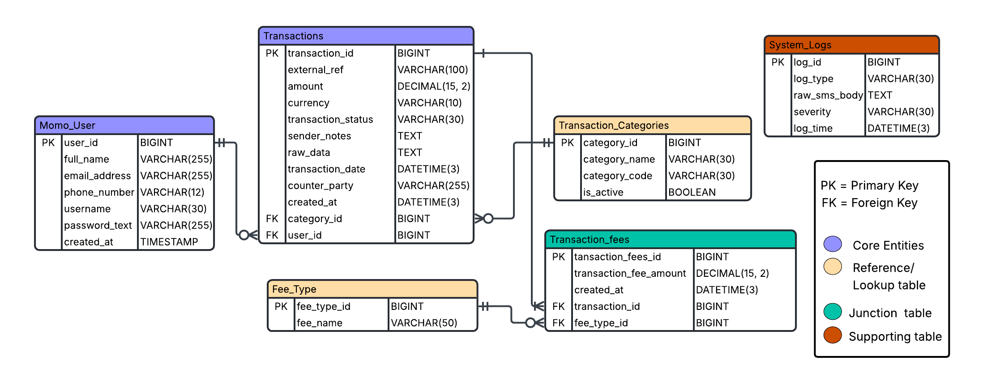

# MoMo-Data-Pipeline-Team-2

## Team 2 - MoMo SMS ETL Project
### Team Members
- Brian
- Derick
- Habibllah
- Yonas

---

## Links
- **Architecture Diagram:** [Link to Architecture Diagram](./docs/images/architecture-diagram.png)
- **ERD Diagram:** [View ERD](./docs/images/erd_diagram.png)
- **ERD Design Rationale:** [Read Justification](./docs/ERD_justification.md)
- **JSON Schema Examples:** [View JSON Schemas](./examples/json_schemas.json)
- **Database Setup Script:** [View SQL Schema](./database/database_setup.sql)
- **Scrum Board:** [Team 2 Scrum Board](https://alustudent-team-k1plq8kl.atlassian.net/jira/software/projects/T2MSEP/boards/34?jql=&atlOrigin=eyJpIjoiN2ZkZGMzNjFhMTZkNGQzODg4MTM1YzI2ZGIyZDZiODAiLCJwIjoiaiJ9)

---

## Project Overview
An enterprise-level fullstack application designed to process Mobile Money (MoMo) SMS transaction data from XML format, categorize transactions intelligently, store them in a normalized relational database, and visualize insights through an interactive dashboard. This system demonstrates modern data engineering practices with ETL pipelines, RESTful APIs, and comprehensive error handling.

### Key Features
- ✅ **XML Parsing & Validation** - Robust SMS data extraction with error handling
- ✅ **Data Normalization** - Clean and standardize amounts, dates, and phone numbers
- ✅ **Intelligent Categorization** - Automatic transaction type classification
- ✅ **Relational Database** - Normalized schema with referential integrity
- ✅ **JSON Schema Definitions** - Complete API response models
- 🚧 **RESTful API** - FastAPI endpoints for data access (In Progress)
- 🚧 **Interactive Dashboard** - Real-time analytics and visualizations (In Progress)
- ✅ **Error Tracking** - Dead letter queue and comprehensive logging

### Technology Stack
| Layer | Technology | Purpose |
|-------|-----------|---------|
| **Backend** | Python 3.x | ETL processing and API server |
| **Database** | MySQL/SQLite | Transaction storage and querying |
| **API Framework** | FastAPI | RESTful API endpoints |
| **Data Parsing** | lxml/ElementTree | XML processing |
| **Frontend** | HTML/CSS/JavaScript | Dashboard visualization |
| **Charts** | Chart.js (planned) | Data visualization |
| **Version Control** | Git/GitHub | Source code management |
| **Project Management** | Jira | Agile sprint tracking |

---

## Table of Contents

- [Project Structure](#project-structure)
- [System Architecture](#system-architecture)
- [Database Design](#database-design)
- [JSON Schema & API Models](#json-schema--api-models)
- [Getting Started](#getting-started)
- [Development Guidelines](#development-guidelines)
- [References & Credits](#references--credits)

---

## Project Structure
```
├── README.md                         # Setup, run, overview
├── .env.example                      # DATABASE_URL or path to SQLite
├── requirements.txt                  # lxml/ElementTree, dateutil, (FastAPI optional)
├── index.html                        # Dashboard entry (static)
├── web/
│   ├── styles.css                    # Dashboard styling
│   ├── chart_handler.js              # Fetch + render charts/tables
│   └── assets/                       # Images/icons (optional)
├── data/
│   ├── raw/                          # Provided XML input (git-ignored)
│   │   └── momo.xml
│   ├── processed/                    # Cleaned/derived outputs for frontend
│   │   └── dashboard.json            # Aggregates the dashboard reads
│   ├── db.sqlite3                    # SQLite DB file
│   └── logs/
│       ├── etl.log                   # Structured ETL logs
│       └── dead_letter/              # Unparsed/ignored XML snippets
├── etl/
│   ├── __init__.py
│   ├── config.py                     # File paths, thresholds, categories
│   ├── parse_xml.py                  # XML parsing (ElementTree/lxml)
│   ├── clean_normalize.py            # Amounts, dates, phone normalization
│   ├── categorize.py                 # Simple rules for transaction types
│   ├── load_db.py                    # Create tables + upsert to SQLite
│   └── run.py                        # CLI: parse -> clean -> categorize -> load -> export JSON
├── api/                              # Optional (bonus)
│   ├── __init__.py
│   ├── app.py                        # Minimal FastAPI with /transactions, /analytics
│   ├── db.py                         # SQLite connection helpers
│   └── schemas.py                    # Pydantic response models
├── scripts/
│   ├── run_etl.sh                    # python etl/run.py --xml data/raw/momo.xml
│   ├── export_json.sh                # Rebuild data/processed/dashboard.json
│   └── serve_frontend.sh             # python -m http.server 8000 (or Flask static)
└── tests/
    ├── test_parse_xml.py             # Small unit tests
    ├── test_clean_normalize.py
    └── test_categorize.py
```
---

## System Architecture

### High-Level Overview
Our system follows a layered architecture pattern with clear separation of concerns:
- **Data Ingestion** → **Processing** → **Storage** → **API/Export** → **Visualization**

[Link to Architecture Diagram](./docs/architecture-diagram.png)

### Architecture Components

#### 1️ Data Source Layer
| Component | Purpose | Technology |
|-----------|---------|------------|
| `momo.xml` | Raw MoMo SMS transaction data in XML format | XML |

#### 2️ ETL Pipeline (Backend Processing)
| Component | File | Purpose |
|-----------|------|---------|
| **XML Parser** | `etl/parse_xml.py` | Reads and validates XML structure, extracts transaction records |
| **Data Cleaner** | `etl/clean_normalize.py` | Normalizes amounts (removes currency symbols), standardizes date formats, normalizes phone numbers |
| **Categorizer** | `etl/categorize.py` | Applies business rules to classify transactions (e.g., airtime, transfer, bill payment) |
| **Error Handler** | Built into pipeline | Captures malformed/invalid data and routes to dead letter queue |
| **ETL Orchestrator** | `etl/run.py` | CLI tool that coordinates the entire ETL workflow |
| **Logger** | `data/logs/etl.log` | Records all ETL operations, errors, and audit trail for debugging and monitoring |

#### 3️ Storage Layer
| Component | File/Location | Purpose |
|-----------|---------------|---------|
| **SQLite Database** | `data/db.sqlite3` | Relational database storing normalized transaction data in structured tables |
| **Dashboard Cache** | `data/processed/dashboard.json` | Pre-aggregated analytics data for fast frontend loading without database queries |
| **Dead Letter Queue** | `data/logs/dead_letter/` | Stores unparsed or invalid XML snippets for manual review and data quality monitoring |

#### 4️ API Layer (Optional - Feature)
| Component | File | Purpose |
|-----------|------|---------|
| **FastAPI Backend** | `api/app.py` | RESTful API server providing programmatic access to transaction data |
| **Endpoints** | | • `GET /transactions` - Retrieve filtered transaction list<br>• `GET /analytics` - Get aggregated statistics<br>• `GET /categories` - List transaction categories |
| **Database Helper** | `api/db.py` | SQLite connection pool and query utilities |
| **Data Schemas** | `api/schemas.py` | Pydantic models for request/response validation |

#### 5️ Presentation Layer (Frontend)
| Component | File | Purpose |
|-----------|------|---------|
| **Dashboard UI** | `index.html` | Main user interface for viewing transactions and analytics |
| **Visualization Engine** | `web/chart_handler.js` | Fetches data and renders interactive charts and tables |
| **Styling** | `web/styles.css` | Responsive design and visual styling |
| **Assets** | `web/assets/` | Icons, images, and other static resources |

#### Automation Scripts
| Script | Purpose | Usage |
|--------|---------|-------|
| `scripts/run_etl.sh` | Executes the complete ETL pipeline from XML to database | `./scripts/run_etl.sh` |
| `scripts/export_json.sh` | Regenerates `dashboard.json` with latest aggregated data | `./scripts/export_json.sh` |
| `scripts/serve_frontend.sh` | Starts local development server for testing the dashboard | `./scripts/serve_frontend.sh` |

### Data Flow
```
1. XML File (momo.xml) 
   ↓
2. ETL Pipeline
   • Parse XML → Extract transactions
   • Clean & Normalize → Standardize formats
   • Categorize → Apply business rules
   • Validate → Route errors to dead letter
   ↓
3. Dual Storage
   • Valid data → SQLite Database (normalized tables)
   • Invalid data → Dead Letter Queue (for review)
   • Logs → etl.log (audit trail)
   ↓
4. Data Access Layer
   • Option A: Export aggregated data → dashboard.json
   • Option B: API endpoints → Real-time queries
   ↓
5. Frontend Visualization
   • Load data (from JSON or API)
   • Render charts, tables, analytics
   • Display to end user
```

### Design Decisions

**Why ETL Pattern?**
- Separates concerns: parsing, cleaning, and loading are independent
- Enables error handling at each stage
- Makes testing and debugging easier

**Why SQLite?**
- Lightweight, no separate server required
- Perfect for development and small-to-medium datasets
- Easy to backup (single file)

**Why dashboard.json?**
- Reduces database load for frequently accessed aggregations
- Faster frontend loading (no API/DB overhead)
- Can be version controlled for change tracking

**Why Dead Letter Queue?**
- Preserves problematic data for investigation
- Prevents data loss
- Helps identify data quality issues

### Error Handling Strategy

Our system implements comprehensive error handling:
- **Validation errors** → Logged with details in `etl.log`
- **Malformed XML** → Stored in `dead_letter/` for manual review
- **Processing failures** → Transaction rolled back, error logged
- **Database errors** → Graceful degradation, user notification

### Scalability Considerations

Current architecture supports:
- Thousands of transactions per run
- Multiple ETL executions per day
- Concurrent frontend users (via static files or API)

For enterprise-scale needs:
- Migrate SQLite → PostgreSQL/MySQL
- Add message queue (RabbitMQ/Kafka) for real-time processing
- Implement caching layer (Redis)
- Deploy API with load balancing

---

## Database Design

### Entity Relationship Diagram


### Design Rationale
[Read the full ERD design justification](./docs/ERD_justification.md)

Our database is built around the core idea that every MoMo transaction involves an individual, a transaction type, and potentially multiple fees. The schema is designed to reflect real-world mobile money operations while maintaining data integrity and query performance.

### Database Schema Overview

The system uses **6 normalized tables** with proper foreign key relationships, check constraints, and strategic indexes:

#### 1. **Momo_User** - User Account Information
Stores mobile money customer profiles and authentication details.

| Column | Type | Constraints | Description |
|--------|------|-------------|-------------|
| `user_id` | BIGINT | PRIMARY KEY, AUTO_INCREMENT | Unique user identifier |
| `full_name` | VARCHAR(255) | NOT NULL | User's full name |
| `email_address` | VARCHAR(255) | NULLABLE | Optional email address |
| `phone_number` | VARCHAR(12) | NOT NULL, UNIQUE | Mobile money phone number (natural key) |
| `username` | VARCHAR(30) | UNIQUE | Optional username for login |
| `password_text` | VARCHAR(255) | NOT NULL | Text password for basic authentication |
| `created_at` | TIMESTAMP | DEFAULT CURRENT_TIMESTAMP | Account creation timestamp |

**Indexes:** `idx_phone_number`, `idx_username`

**Design Notes:**
- Phone number serves as the natural key (how the system identifies users)
- Numeric `user_id` as surrogate key for fast joins and stability
- Both phone and username indexed for quick lookups

---

#### 2. **Transaction_Categories** - Transaction Type Lookup
Reference table for transaction classification (Transfer, Airtime, Bill Payment, etc.).

| Column | Type | Constraints | Description |
|--------|------|-------------|-------------|
| `category_id` | BIGINT | PRIMARY KEY, AUTO_INCREMENT | Unique category identifier |
| `category_name` | VARCHAR(30) | NOT NULL | Display name for category |
| `category_code` | VARCHAR(30) | NOT NULL, UNIQUE | Internal code for application logic |
| `is_active` | BOOLEAN | DEFAULT TRUE | Whether category is currently active |

**Indexes:** `idx_category_code`

**Design Notes:**
- Separate lookup table allows category changes without rewriting transaction history
- Each transaction points to exactly one category
- `is_active` flag enables soft deletion of categories

**Sample Categories:**
- Transfer, Payment, Deposit, Withdrawal, Airtime Purchase, Bill Payment

---

#### 3. **Transactions** - Core Transaction Records
Main table storing all mobile money transaction details from SMS data.

| Column | Type | Constraints | Description |
|--------|------|-------------|-------------|
| `transaction_id` | BIGINT | PRIMARY KEY, AUTO_INCREMENT | Unique transaction identifier |
| `external_ref` | VARCHAR(100) | NOT NULL | External transaction reference from SMS |
| `amount` | DECIMAL(15, 2) | NOT NULL, CHECK (≥ 0) | Transaction amount |
| `currency` | VARCHAR(10) | DEFAULT 'RWF', CHECK (IN 'RWF','ETB','USD') | Currency code |
| `transaction_status` | VARCHAR(30) | DEFAULT 'COMPLETED', CHECK (IN 'COMPLETED','FAILED','PENDING') | Transaction status |
| `sender_notes` | TEXT | NULLABLE | Optional transaction notes from sender |
| `raw_data` | TEXT | NOT NULL | Original SMS message body (audit trail) |
| `transaction_date` | DATETIME(3) | NOT NULL | When transaction actually occurred |
| `counter_party` | VARCHAR(255) | NULLABLE | Name of other party in transaction |
| `created_at` | DATETIME(3) | DEFAULT CURRENT_TIMESTAMP(3) | Database insertion timestamp |
| `category_id` | BIGINT | FOREIGN KEY → Transaction_Categories | Transaction category |
| `user_id` | BIGINT | FOREIGN KEY → Momo_User | Mobile money user |

**Foreign Keys:**
- `category_id` → `Transaction_Categories(category_id)` (ON DELETE RESTRICT, ON UPDATE CASCADE)
- `user_id` → `Momo_User(user_id)` (ON DELETE RESTRICT, ON UPDATE CASCADE)

**Indexes:** `idx_user_id`, `idx_category_id`, `idx_transaction_date`, `idx_transaction_status`, `idx_external_ref`

**Design Notes:**
- `raw_data` preserves original SMS for auditing and debugging
- Multiple indexes support common query patterns (by user, date, status)
- Check constraints ensure data validity at database level
- Millisecond precision timestamps for accurate ordering

---

#### 4. **Fee_Type** - Fee Classification Lookup
Reference table for different types of fees that can be applied to transactions.

| Column | Type | Constraints | Description |
|--------|------|-------------|-------------|
| `fee_type_id` | BIGINT | PRIMARY KEY, AUTO_INCREMENT | Unique fee type identifier |
| `fee_name` | VARCHAR(50) | NOT NULL | Fee type name |

**Indexes:** `idx_fee_name`

**Sample Fee Types:**
- Transaction Fee, Tax, Service Charge, Agent Commission, Processing Fee

---

#### 5. **Transaction_fees** - Junction Table (Many-to-Many)
Resolves the many-to-many relationship between transactions and fee types.

| Column | Type | Constraints | Description |
|--------|------|-------------|-------------|
| `transaction_fees_id` | BIGINT | PRIMARY KEY, AUTO_INCREMENT | Unique fee record identifier |
| `transaction_fee_amount` | DECIMAL(15, 2) | NOT NULL, DEFAULT 0, CHECK (≥ 0) | Actual fee amount charged |
| `created_at` | DATETIME(3) | DEFAULT CURRENT_TIMESTAMP(3) | Fee record creation timestamp |
| `transaction_id` | BIGINT | FOREIGN KEY → Transactions | Reference to parent transaction |
| `fee_type_id` | BIGINT | FOREIGN KEY → Fee_Type | Type of fee applied |

**Foreign Keys:**
- `transaction_id` → `Transactions(transaction_id)` (ON DELETE CASCADE, ON UPDATE CASCADE)
- `fee_type_id` → `Fee_Type(fee_type_id)` (ON DELETE RESTRICT, ON UPDATE CASCADE)

**Indexes:** `idx_transaction_id`, `idx_fee_type_id`

**Unique Constraint:** `UNIQUE(transaction_id, fee_type_id)` - Prevents duplicate fee types per transaction

**Design Notes:**
- A single transaction can have multiple fees (e.g., transaction fee + tax)
- The same fee type can apply to thousands of transactions
- Junction table avoids messy arrays or data duplication
- CASCADE delete ensures orphaned fees are cleaned up

---

#### 6. **System_Logs** - ETL Processing Logs
Captures pipeline errors, events, and operational data for debugging and monitoring.

| Column | Type | Constraints | Description |
|--------|------|-------------|-------------|
| `log_id` | BIGINT | PRIMARY KEY, AUTO_INCREMENT | Unique log entry identifier |
| `log_type` | VARCHAR(30) | NOT NULL, CHECK (IN 'PARSE_ERROR','DB_ERROR','VALIDATION_ERROR','BATCH_START','BATCH_COMPLETE') | Type of log entry |
| `raw_sms_body` | TEXT | NULLABLE | Raw SMS content if parsing error occurred |
| `severity` | VARCHAR(30) | DEFAULT 'INFO', CHECK (IN 'ERROR','WARNING','INFO') | Log severity level |
| `log_time` | DATETIME(3) | DEFAULT CURRENT_TIMESTAMP(3) | When log entry was created |

**Indexes:** `idx_log_type`, `idx_severity`, `idx_log_time`

**Design Notes:**
- Separates operational logs from financial transaction data
- Preserves problematic SMS messages for debugging
- Supports batch processing tracking (start/complete events)
- Enables error analysis and data quality monitoring

---

### Database Features

✅ **Normalized Schema** - 3NF compliance with proper primary and foreign key relationships  
✅ **Referential Integrity** - Foreign key constraints with appropriate CASCADE/RESTRICT rules  
✅ **Data Validation** - Check constraints for currency codes, status values, non-negative amounts  
✅ **Performance Optimization** - Strategic indexes on frequently queried columns  
✅ **Audit Trail** - Raw SMS storage and comprehensive system logs  
✅ **Sample Data** - Pre-populated with 7 users, 6 categories, 9 transactions, 12 fee records, 7 log entries  

### Key Relationships

```
Momo_User (1) ──────< (N) Transactions
Transaction_Categories (1) ──────< (N) Transactions
Transactions (N) >──────< (M) Fee_Type  [via Transaction_fees junction table]
```

---

## JSON Schema & API Models

### Overview
The project includes comprehensive JSON schema definitions for all database entities, demonstrating how relational data is serialized for API responses. These schemas follow JSON Schema Draft-07 specification.

**Location:** [`examples/json_schemas.json`](./examples/json_schemas.json)

### Available Schemas

#### 1. **MoMo User Schema**
Represents a mobile money user account with validation rules.

```json
{
  "user_id": 1,
  "full_name": "John Doe",
  "email_address": "john.doe@example.com",
  "phone_number": "250788123456",
  "username": "johndoe",
  "created_at": "2024-05-10T16:30:51Z"
}
```

**Validation Rules:**
- `phone_number`: Must match pattern `^[0-9]{12}$`
- `email_address`: Optional, must be valid email format
- Required fields: `user_id`, `full_name`, `phone_number`, `created_at`

---

#### 2. **Transaction Category Schema**
Defines transaction type classification.

```json
{
  "category_id": 1,
  "category_name": "Transfer",
  "category_code": "TRANSFER",
  "is_active": true
}
```

---

#### 3. **Fee Type Schema**
Represents different fee classifications.

```json
{
  "fee_type_id": 1,
  "fee_name": "Transaction Fee"
}
```

---

#### 4. **Transaction Fee Schema (Nested)**
Demonstrates the junction table entity with nested relationships.

```json
{
  "transaction_fees_id": 1,
  "transaction_fee_amount": 0.0,
  "created_at": "2024-05-10T16:30:55Z",
  "transaction": {
    "transaction_id": 1,
    "external_ref": "76662021700",
    "amount": 2000.0,
    "currency": "RWF"
  },
  "fee_type": {
    "fee_type_id": 1,
    "fee_name": "Transaction Fee"
  }
}
```

---

#### 5. **System Log Schema**
Captures ETL processing events and errors.

```json
{
  "log_id": 3,
  "log_type": "PARSE_ERROR",
  "raw_sms_body": "TxId: INVALID. Amount field missing from SMS body.",
  "severity": "ERROR",
  "log_time": "2024-05-11T10:30:00Z"
}
```

**Enums:**
- `log_type`: PARSE_ERROR, DB_ERROR, VALIDATION_ERROR, BATCH_START, BATCH_COMPLETE
- `severity`: ERROR, WARNING, INFO

---

#### 6. **Complete Transaction Schema (Complex Object)**
The most comprehensive schema showing a full transaction with all related data nested.

```json
{
  "transaction_id": 4,
  "external_ref": "DEPOSIT001",
  "amount": 40000.0,
  "currency": "RWF",
  "transaction_status": "COMPLETED",
  "sender_notes": null,
  "raw_data": "*113*R*A bank deposit of 40000 RWF...",
  "transaction_date": "2024-05-11T18:43:49Z",
  "counter_party": "Bank Deposit",
  "created_at": "2024-05-11T18:44:02Z",
  "user": {
    "user_id": 1,
    "full_name": "John Doe",
    "phone_number": "250788123456",
    "email_address": "john.doe@example.com",
    "username": "johndoe"
  },
  "category": {
    "category_id": 3,
    "category_name": "Deposit",
    "category_code": "DEPOSIT",
    "is_active": true
  },
  "fees": [
    {
      "transaction_fees_id": 5,
      "fee_type": {
        "fee_type_id": 1,
        "fee_name": "Transaction Fee"
      },
      "transaction_fee_amount": 100.0,
      "created_at": "2024-05-11T18:44:02Z"
    },
    {
      "transaction_fees_id": 6,
      "fee_type": {
        "fee_type_id": 2,
        "fee_name": "Tax"
      },
      "transaction_fee_amount": 50.0,
      "created_at": "2024-05-11T18:44:02Z"
    }
  ],
  "total_fees": 150.0,
  "total_cost": 40150.0
}
```

**Features:**
- Demonstrates proper nesting of related entities
- Shows many-to-many relationship via `fees` array
- Includes computed fields (`total_fees`, `total_cost`)
- Complete data structure for API responses

### API Response Design Patterns

The JSON schemas demonstrate several best practices:

1. **Nested Objects** - Related entities embedded for single-request data retrieval
2. **Computed Fields** - Derived values like `total_fees` calculated server-side
3. **Proper Data Types** - Numbers for amounts, ISO 8601 for timestamps
4. **Enum Validation** - Restricted values for status, currency, log types
5. **Optional Fields** - Nullable fields clearly marked in schema

These schemas serve as the foundation for the planned FastAPI endpoints.

---

## Getting Started

### Prerequisites
- Python 3.8 or higher
- MySQL 8.0+ or SQLite 3.x
- Git
- pip (Python package manager)

### Installation

1. **Clone the repository**
```bash
git clone https://github.com/ydejene/MoMo-Data-Pipeline-Team-2.git
cd MoMo-Data-Pipeline-Team-2
```

2. **Create virtual environment**
```bash
python -m venv venv
# Windows
venv\Scripts\activate
# Linux/Mac
source venv/bin/activate
```

3. **Install dependencies**
```bash
pip install -r requirements.txt
```

4. **Set up the database**

For MySQL:
```bash
mysql -u root -p < database/database_setup.sql
```

For SQLite (development):
```bash
# Database will be created automatically by ETL scripts
# Location: data/db.sqlite3
```

5. **Configure environment variables**
```bash
cp .env.example .env
# Edit .env with your database credentials
```

### Running the Application

#### ETL Pipeline
```bash
# Run complete ETL process
python etl/run.py --xml data/raw/momo.xml

# Or use the convenience script
./scripts/run_etl.sh
```

#### API Server (when implemented)
```bash
# Start FastAPI server
uvicorn api.app:app --reload --port 8000
```

#### Dashboard (when implemented)
```bash
# Serve static frontend
python -m http.server 8000
# Or use the script
./scripts/serve_frontend.sh
```

### Project Status

| Component | Status | Notes |
|-----------|--------|-------|
| Database Schema | ✅ Complete | 6 tables with sample data |
| JSON Schemas | ✅ Complete | All entities documented |
| ERD Documentation | ✅ Complete | Diagram and justification |
| ETL Pipeline | 🚧 In Progress | Parser and cleaner modules |
| API Endpoints | 🚧 Planned | FastAPI implementation |
| Dashboard UI | 🚧 Planned | HTML/CSS/JS visualization |
| Unit Tests | 📋 Planned | Test coverage for ETL |

---

## Development Guidelines

### Code Organization
- **ETL modules** - Keep parsing, cleaning, and categorization separate
- **API endpoints** - Follow RESTful conventions
- **Database queries** - Use parameterized queries to prevent SQL injection
- **Error handling** - Log errors comprehensively, fail gracefully

### Git Workflow
1. Create feature branch from `main`
2. Make atomic commits with descriptive messages
3. Test locally before pushing
4. Create pull request for team review
5. Merge after approval

### Naming Conventions
- **Python files:** `snake_case.py`
- **Classes:** `PascalCase`
- **Functions/variables:** `snake_case`
- **Constants:** `UPPER_SNAKE_CASE`
- **Database tables:** `PascalCase` (e.g., `Momo_User`)
- **Database columns:** `snake_case`

### Testing Strategy
- Unit tests for each ETL module
- Integration tests for database operations
- API endpoint testing with sample data
- Frontend UI testing for dashboard

---

## References & Credits

### Tools & Technologies Used
- **Eraser.io** - Architecture diagram design and generation
- **GitHub** - Version control and team collaboration
- **Jira** - Agile project management and sprint tracking
- **MySQL Workbench** - Database design and ERD creation
- **Python** - ETL pipeline and backend development
- **FastAPI** - RESTful API framework (planned)
- **JSON Schema** - API data model validation

### Documentation Standards
- Project structure inspired by industry best practices
- ETL patterns based on data engineering principles
- Database normalization following 3NF standards
- JSON Schema Draft-07 specification
- RESTful API design conventions

### Team Contributions
This project is a collaborative effort by Team 2 as part of the MoMo SMS Data Processing assignment. All team members contributed to planning, design, and implementation.

### License
This project is licensed under the MIT License - see the [LICENSE](./LICENSE) file for details.

Copyright (c) 2026 ydejene

---

**Last Updated:** January 2026  
**Project Status:** In Active Development 🚧
